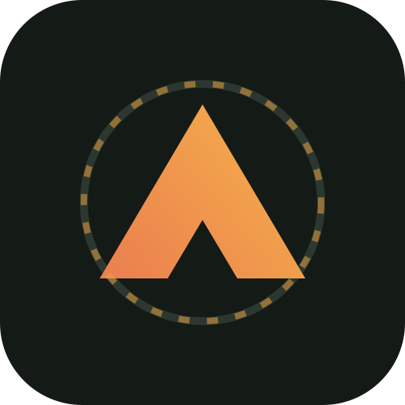
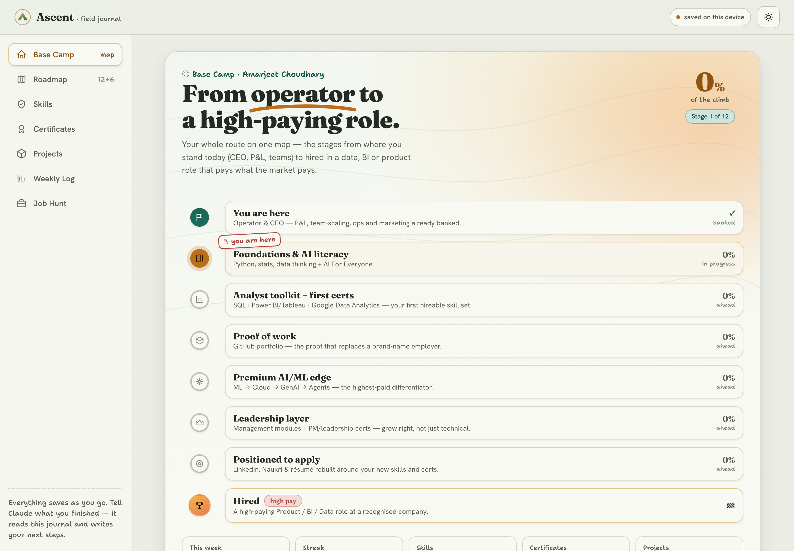
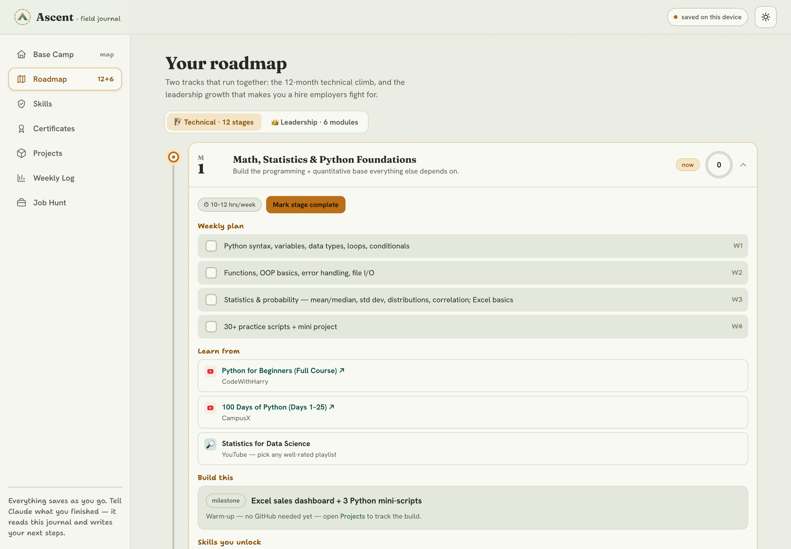
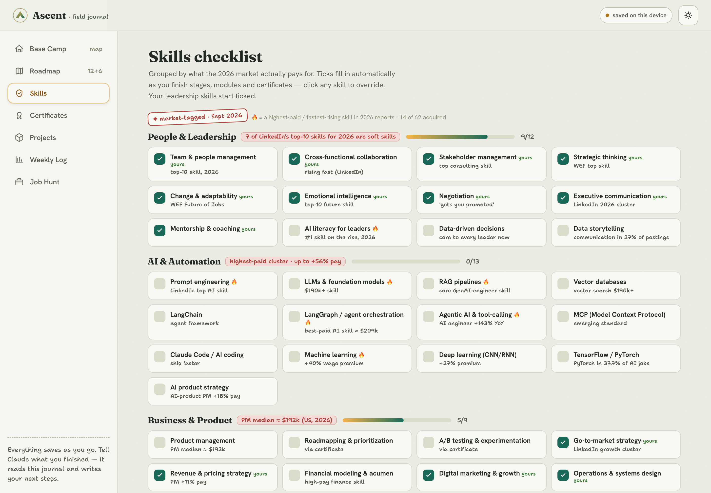

<div align="center">



# Ascent — Career OS

**A self-built platform that turns a career change into a trackable, market-driven system.**

From *operator* to a high-paying data, BI or product role — one stage, one project, one credential at a time.

[**▶ Live demo**](https://amarch321-code.github.io/ascent-career-os/) &nbsp;·&nbsp; [The product story](#-the-product-story-how-ascent-was-built) &nbsp;·&nbsp; [Features](#-what-it-does)

   

</div>

---

Ascent is a personal **career operating system** I designed and shipped to manage my own transition from a business/operations leadership background into data, BI and product roles. It maps a 12-month learning roadmap, an auto-updating skills checklist, a certificate tracker, a GitHub project portfolio, weekly study logging and a job-application funnel — **grounded in live 2026 hiring-market data** rather than guesswork.

> **Why it exists:** career-change advice is generic and scattered across PDFs, YouTube playlists and spreadsheets. I wanted one place that tells me *what to learn next, why it pays, what to build, and when to add it to my CV* — and that tracks progress from day one to a signed offer.



---

## ✨ What it does

| Area | What it does |
|---|---|
| **Career-arc map** | The whole journey on one screen — from *Operator/CEO* to *Hired* — with live progress on each stage. |
| **12-stage roadmap** | Month-by-month plan (Python → Data → SQL/BI → ML → GenAI → Agents) with weekly tasks, real course links and a milestone project each stage. |
| **Leadership track** | A parallel set of "learn + apply-at-work" modules, because 7 of LinkedIn's top-10 2026 skills are human skills — not just technical ones. |
| **Skills checklist** | 62 skills grouped by 2026 demand clusters, each tagged with its pay premium / share of job postings. Ticks fill in automatically as stages, modules and certificates complete. |
| **Certificates** | Brand-name credential tracker that generates the exact LinkedIn + résumé text to paste when each one is earned. |
| **Projects** | The GitHub portfolio pieces, with per-project build checklists and repo links. |
| **Weekly log** | Hours-per-week logging with a to-scale chart, a goal line and a consistency streak. |
| **Job hunt** | Application funnel with response-rate stats. |

Everything **persists across sessions and devices** and is designed so an AI assistant can read the current state and write the next steps back into it.

---

## 📖 The product story (how Ascent was built)

*This section is written as a product case study — the thinking behind the build, not just the features.*

### 1. The problem
Switching careers from a non-technical, non-brand-name background is an information problem as much as a skills problem: *hundreds* of possible skills, no signal on which ones actually pay, and no single view of progress. I was managing it across a roadmap PDF, a benchmark person's LinkedIn, and my own résumé — three disconnected documents.

### 2. Discovery
I framed one job-to-be-done: **"Tell me the next right move, tell me why it's worth it, and show me how far I've come."** That reframed the product from a to-do list into a *decision engine* — a map with a clear destination, not a checklist.

### 3. Research (the part that makes it credible)
Rather than list generic skills, I grounded the content in **current market data** — LinkedIn *Skills on the Rise 2026*, the WEF *Future of Jobs* report, and 2026 salary/skills studies for PM, data-analyst and AI roles. Findings that shaped the product:
- **AI literacy is the #1 rising skill**, and **7 of the top 10 are human/leadership skills** → so the product leads with a leadership track, not just a coding track.
- Highest-paid technical skills: agent orchestration (~$209k), LLM/RAG, ML (+40% wage premium) → these are flagged as the differentiators.
- Analyst reality from real postings: Excel 81%, SQL 60%, Power BI 43%, Python 41% → these anchor the "first hireable skill set" stage.

Every skill in the app carries the tag it earned from that research.

### 4. Key design decisions
- **A map, not a list.** The home screen is a hand-drawn career arc so the *destination* is always visible — motivation beats organisation.
- **Two tracks, one climb.** Technical depth and leadership growth run in parallel, because the market rewards the combination.
- **Auto-ticking skills.** Completing a stage, module or certificate ticks the skills it teaches — progress should be a *consequence* of doing the work, not a second chore.
- **Made for an AI copilot.** State lives in a small database so an assistant can update progress and generate next steps — the "backend" is conversational.
- **Zero dependencies, offline-first.** Vanilla HTML/CSS/JS, no build step, installable as a PWA, works with no network — so it's fast, portable and can't rot.

### 5. Iteration
The first build was a clean dashboard. Feedback ("it feels generic, make it human; put the roadmap on the front; base it on the latest market data") drove a second pass: a crafted *field-journal* visual identity (custom type pairing, hand-drawn elements, paper texture), the front-page career map, and the market-data tagging — then a full QA pass that found and fixed nine issues (an unreachable stage, sample data leaking into stats, a responsive nav-label overflow, and more).

### 6. What I'd do next
Real cloud database + sign-in for multi-device sync, a shareable public "progress" view, and an assistant integration that proposes the week's plan automatically.

---

## 🖼 Screens

| Roadmap (technical + leadership tracks) | Market-tagged skills |
|---|---|
|  |  |

---

## 🏗 How it works

```
index.html            # app shell + markup
css/styles.css        # design system: tokens, both themes, components, motion
js/
 ├─ data.js           # reference data: curriculum, skills, certs, career arc
 ├─ state.js          # state, derived selectors, persistence (db + localStorage)
 └─ app.js            # views, interactions, boot
manifest.webmanifest  # installable PWA
```

- **Rendering:** a tiny view layer — each screen is a pure function of state; navigation swaps sections; interactions mutate state and re-render. No framework.
- **State & persistence:** a single state object is the source of truth. It writes to a cloud document store when available and **falls back to `localStorage`** otherwise, so the app works fully offline and standalone.
- **Design system:** all colour, type and spacing are CSS custom properties with complete light **and** dark palettes; motion respects `prefers-reduced-motion`; layout is responsive to a phone-width bottom-nav.
- **Data-driven content:** the entire curriculum, skill set and credential list live as data, so the plan can be re-scoped without touching the UI.

## 🧰 Tech

`HTML5` · `CSS3 (custom properties, grid/flex, container-free responsive)` · `Vanilla JavaScript (ES2020)` · `SVG` · `PWA (manifest + offline)` · **no build tools, no dependencies.**

## ▶ Run it locally

```bash
# clone, then serve the folder (any static server works)
python3 -m http.server 8000
# open http://localhost:8000
```

Or just open `index.html` in a browser. *(Web fonts load from Google Fonts when online; everything else is local.)*

## 🤝 A note on how it was built

Ascent was **conceived, researched, designed and directed by me**, and built with **AI-assisted development (Claude Code)** — the same agentic-AI workflow that appears in the roadmap itself. I own the product decisions, the market research and the architecture; AI was the pair-programmer. Being able to ship real software this way is, deliberately, one of the skills the project is meant to demonstrate.

## 👋 Author

**Amarjeet Choudhary** — operations & business leader moving into data / BI / product.
[LinkedIn](https://www.linkedin.com/in/amarjeetchoudhary)

## 📄 License

MIT — see [LICENSE](LICENSE).
